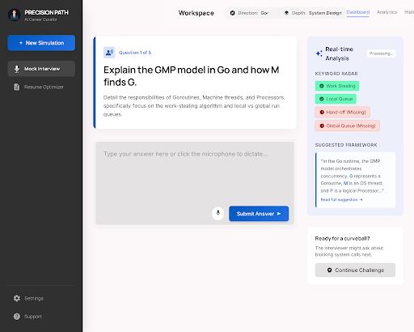
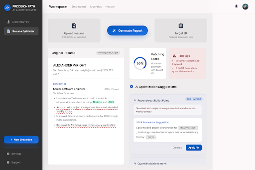

# Interview Assistant

一个给开发者准备面试用的本地 AI 工作台。

它把「模拟面试」「推荐背题答案」「简历匹配分析」「STAR 改写」「Obsidian 知识沉淀」「Prompt 可视化调优」放在同一个桌面式 Web 应用里。目标不是做一个复杂平台，而是做一个你每天打开就能练、能改、能沉淀的个人工具。

基于 Vue 3 + Spring Boot 3 + Spring AI 构建，接入智谱 GLM 的 OpenAI 兼容接口。本项目面向本地个人部署，不需要数据库、不需要登录、不需要复杂服务端。

## 你可以用它做什么

### 面试演练室

- 选择技术方向：Go 后端、React 前端、系统设计、数据库相关、AI Agent 开发方向
- 选择面试题型：基础八股、深度原理、项目实战
- AI 生成真实面试题，并基于你的回答给出关键词命中、评分和点评
- 支持流式输出，点评不会等一整段生成完才出现
- 一键生成「背题答案」，支持 Markdown 和代码块，方便复制整理
- 可把推荐答案或面试反馈保存到 Obsidian 知识库

### 简历调优台

- 粘贴 JD 和简历，获得匹配度分析
- 识别简历短板，比如技能缺口、项目表达薄弱、业务影响不清楚
- 基于建议生成 STAR 改写范例
- 一键把优化后的描述应用回简历编辑区
- 对过短、无效、随便输入的简历内容做基础拦截，避免虚高评分

### Obsidian 知识库

- 在设置页配置本地 Obsidian Vault 路径
- 面试反馈和推荐答案可一键保存为 Markdown 笔记
- 默认保存到：

```text
<你的 Obsidian Vault>/面试知识库/
```

- 笔记带 YAML frontmatter，Obsidian 可以直接识别属性
- 应用内可浏览、筛选、搜索这些笔记
- 不需要 Obsidian 插件，不需要额外同步服务

### Prompt 管理

- 所有提示词都放在 `backend/prompts/` 下
- 设置页可以查看、编辑、保存提示词
- 支持用 AI 生成提示词优化草稿
- 修改后下一次请求立即生效，不需要重新编译

## 预览

### 面试演练室



### 简历调优台



## 为什么适合个人本地使用

**本地优先**

你的 API Key、模型配置、Prompt、Obsidian Vault 路径都保存在本机。项目不设计多用户、不设计云端账号体系。

**无数据库**

后端只用 `backend/settings.properties` 保存配置；前端临时状态使用 LocalStorage；知识沉淀直接写入 Obsidian Markdown。

**数据可迁移**

最重要的面试沉淀都是 `.md` 文件。你可以继续用 Obsidian、Git、iCloud、坚果云或其他方式管理自己的知识库。

**可调 Prompt**

如果你觉得 AI 回答风格不对、评分太松、输出格式不稳定，可以直接在设置页调 Prompt。

**足够简单**

它不是招聘 SaaS，也不是企业面试平台。它就是一个本地运行的个人面试准备工具。

## 技术栈

| 层 | 技术 |
| --- | --- |
| 前端 | Vue 3.4, TypeScript 5, Vite 5, Pinia, Vue Router |
| 样式 | Tailwind CSS |
| 后端 | Spring Boot 3.3, Java 17 |
| AI | Spring AI 1.1, 智谱 GLM OpenAI 兼容接口 |
| 流式输出 | Server-Sent Events |
| 本地配置 | `backend/settings.properties` |
| 知识库 | Obsidian Vault Markdown |
| 前端状态 | LocalStorage |

## 环境准备

你需要：

- Node.js 18+
- Java 17
- Maven 3.8+
- 智谱 AI API Key：[https://open.bigmodel.cn/](https://open.bigmodel.cn/)
- 可选：Obsidian 和一个本地 Vault

## 快速启动

### 1. 克隆项目

```bash
git clone <repository-url>
cd interviewAssistant
```

### 2. 启动后端

```bash
cd backend
mvn spring-boot:run
```

后端默认地址：

```text
http://localhost:8080
```

首次运行可以先不配置环境变量，直接在页面设置里填写 API Key。

如果你更喜欢用环境变量，也可以这样：

```bash
export ZHIPU_API_KEY="your_api_key_here"
```

设置页保存的 API Key、模型和 Obsidian Vault 路径默认持久化到：

```text
backend/settings.properties
```

如果你想把配置文件放到别的位置：

```bash
export SETTINGS_FILE="/absolute/path/to/settings.properties"
```

### 3. 启动前端

另开一个终端：

```bash
cd frontend
npm install
npm run dev
```

前端默认地址：

```text
http://localhost:5173
```

Vite 会把 `/api` 自动代理到后端。

## 第一次使用建议

1. 打开 `http://localhost:5173`
2. 进入「设置」
3. 填写智谱 AI API Key
4. 模型先选择 `glm-4-flash`
5. 如果你使用 Obsidian，填写 Vault 的绝对路径
6. 回到「面试演练室」，生成一道题
7. 回答后查看关键词命中和 AI 点评
8. 点击「AI 推荐背题答案」
9. 把有价值的答案保存到知识库

## Obsidian 知识库说明

配置 Vault 后，应用会在 Vault 下创建或使用：

```text
面试知识库/
  后端/
  前端/
  系统设计/
```

保存的笔记示例：

```markdown
---
title: "请解释 Go 的垃圾回收机制"
direction: "后端"
tags: ["GC", "三色标记", "写屏障"]
created: "2026-04-23T14:30:00"
source: "recommended-answer"
questionId: "q_001"
---

## 背题思路

...
```

应用只读写 `面试知识库/` 里的 Markdown 文件，避免污染你的 Vault 根目录。

## Prompt 目录

```text
backend/prompts/
  interview/
    system.md
    question.md
    feedback-json.md
    feedback-stream.md
    recommended-answer.md
  resume/
    system.md
    analyze.md
    rewrite.md
  settings/
    prompt-improver.md
```

默认读取 `backend/prompts/`。如果想使用外部 Prompt 目录：

```bash
export PROMPT_DIR="/absolute/path/to/prompts"
```

## 项目结构

```text
interviewAssistant/
  frontend/
    src/
      api/          # HTTP 和 SSE 请求封装
      stores/       # Pinia 状态
      views/        # 页面
      types/        # TypeScript 类型
      utils/        # Markdown 和 LocalStorage 工具
  backend/
    prompts/        # LLM Prompt 模板
    src/main/java/com/interviewassistant/
      controller/   # REST 和 SSE 接口
      service/      # AI、设置、Obsidian 文件服务
      dto/          # 请求和响应对象
      config/       # AI、CORS 配置
      common/       # 通用响应和异常处理
  docs/             # 需求和设计文档
  openspec/         # 变更规格说明
  stitch-export/    # 设计稿导出资源
```

## API 概览

| 方法 | 路径 | 说明 |
| --- | --- | --- |
| POST | `/api/interview/question` | 生成面试题 |
| POST | `/api/interview/feedback` | 分析回答，返回关键词命中和评分 |
| POST | `/api/interview/feedback/stream` | 流式输出详细点评 |
| POST | `/api/interview/recommended-answer/stream` | 流式输出推荐背题答案 |
| POST | `/api/resume/analyze` | JD 和简历匹配分析 |
| POST | `/api/resume/rewrite/stream` | STAR 改写流式输出 |
| GET | `/api/knowledge/notes` | 获取知识库笔记列表 |
| GET | `/api/knowledge/note?id=...` | 获取笔记详情 |
| POST | `/api/knowledge/notes` | 保存笔记到 Obsidian |
| GET | `/api/knowledge/search` | 搜索知识库 |
| GET | `/api/settings/apikey` | 获取 API Key 脱敏状态 |
| POST | `/api/settings/apikey` | 保存 API Key |
| GET | `/api/settings/model` | 获取当前模型 |
| POST | `/api/settings/model` | 保存模型 |
| GET | `/api/settings/vault` | 获取 Obsidian Vault 配置 |
| POST | `/api/settings/vault` | 保存 Obsidian Vault 路径 |
| GET | `/api/settings/prompts` | 列出 Prompt 文件 |
| GET | `/api/settings/prompts/content` | 获取 Prompt 内容 |
| PUT | `/api/settings/prompts/content` | 保存 Prompt 内容 |
| POST | `/api/settings/prompts/improve` | AI 优化 Prompt |

## 常见问题

### 1. 为什么重启后 API Key 失效？

请看后端启动日志里的：

```text
Settings file resolved: ...
```

应用会从这个路径读取配置。默认应指向 `backend/settings.properties`。如果你用 IDE 启动，建议确认工作目录，或显式设置 `SETTINGS_FILE`。

### 2. 遇到 401 怎么办？

通常是 API Key 无效、过期或复制错误。进入「设置」重新保存 API Key，然后再试。模型建议先用 `glm-4-flash`。

### 3. 遇到 429 怎么办？

说明触发了供应商速率限制。等 30 到 60 秒再试，或者换额度更高的 Key/模型。

### 4. Obsidian 笔记保存失败？

检查 Vault 路径是否是绝对路径，并且后端进程对该目录有读写权限。路径应填 Vault 根目录，不是某个子文件夹。

### 5. Markdown 标题显示不正常？

推荐答案和点评会走前端 Markdown 渲染。提示词里也要求输出标准 Markdown，例如 `## 标题`，标题符号后需要有空格。

## 适合继续迭代的方向

- 增加更多技术方向和题库风格
- 为 Obsidian 笔记增加复习状态
- 增加错题回顾和按标签刷题
- 增加简历版本快照
- 增加一键导出面试复盘 Markdown

## License

MIT
